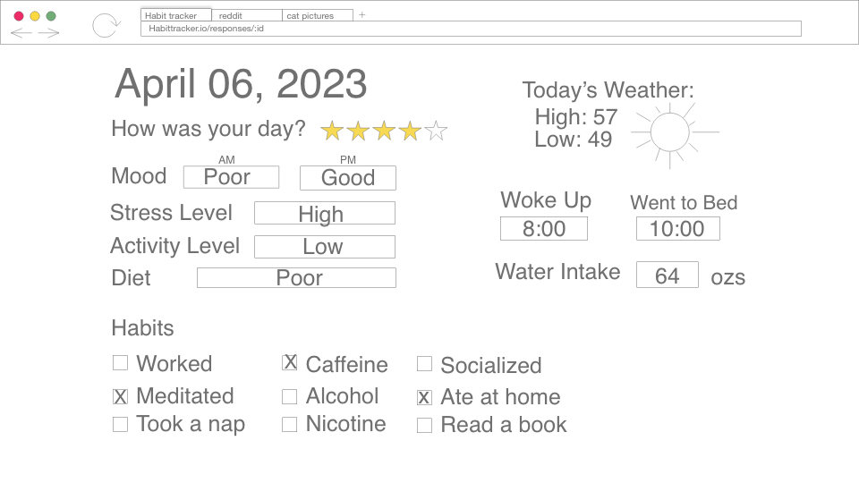

# Daily Habit Tracker
This habit tracker allows you to store information about a user's daily activities, mood and outlook. The intention is to help the user discover links between their daily activities and the impacts on their overall mood and outlook. The app also uses the Mapbox and Open-Mateo APIs to all the app to track weather associated with the user's given location. With enough data, this app has a goal of finding correlation in a user's day to their given responses to mood and outlook. 

## APIs Used 

### Mapbox 
Forward geocoding used to retrieve latitude and longitude of a user's zip code. These coordinates will feed the Open-Mateo API.
\

### Open-Mateo
Sending the user's latitude and longitude returns the current weather forecast. This will be used to provide weather data as a supplement to daily responses.  \
\

## Entity Relational Diagram
The app consists of 3 models: Users, Settings and Responses. Users and Settings have a one:one relationship while Users and Responses have a one:many relationship. 

## RESTful Routing Chart

| VERB   | URL             | CRUD    | DESCRIPTION                                  | VIEW        |
|:------ |:--------------- |:------- |:-------------------------------------------- |:----------- |
| GET    | /               | Read    | Landing Page                                 | Home        |
|        |                 |         |                                              |             |
|        |                 |         |                                              |             |
| POST   | /users          | Create  | Add user data to db                          |             |
| GET    | /users/new      | Read    | Display signup form                          | Signup Form |
| GET    | /users/login    | Read    | Display login form                           | Login Form  |
| POST   | /users/login    | Read    | Checks user credentials against db           |             |
| GET    | /users/login    | Read    | Logout user by clearing cookies              |             |
| GET    | /users/profile  | Read    | Display user data                            | Profile     |
| GET    | /users/settings | Read    | Display users settings                       |             |
| PUT    | /users          | Update  | Update user settings                         |             |
|        |                 |         |                                              |             |
| GET    | /habits         | Read    | Displays current user settings               | Settings    |
| POST   | /habits         | Create  | Defines users' daily habits during setup     |             |
| PUT    | /habits         | Update  | Updates a users' habits                      |             |
|        |                 |         |                                              |             |
| GET    | /responses      | Read    | Displays past entries                        | Past habits |
| GET    | /responses/new  | Read    | Display the current day's form               | Habit Form  |
| POST   | /responses      | Create  | Enters current day's form to the db          |             |
| GET    | /responses/:id  | Read    | Displays responses related to a specific day | Past entry  |
| PUT    | /responses/:id  | Update  | Update an existing record of a day's entries |             |
| DELETE | /responses      | Destroy | Deletes a previous entry                     |             |

## Wireframes

 

## User Stories
As a user, I want to be able to store daily activity data based on my mood and habits. \
As a user, I want to be able to retrieve past habit and weather responses to find correlation in my mood. 

## MVP Goals
- Store user daily activity data in a relational database
- Users are able to login and retrieve past entries
- Complete RESTful routes for daily user entries
- Retrieve and display weather information from an API

## Stretch Goals
- Incorporate a daily motivational quote API
- Ability to display aggregate past data in one view
- Add visual components for past data such as charts or graphs